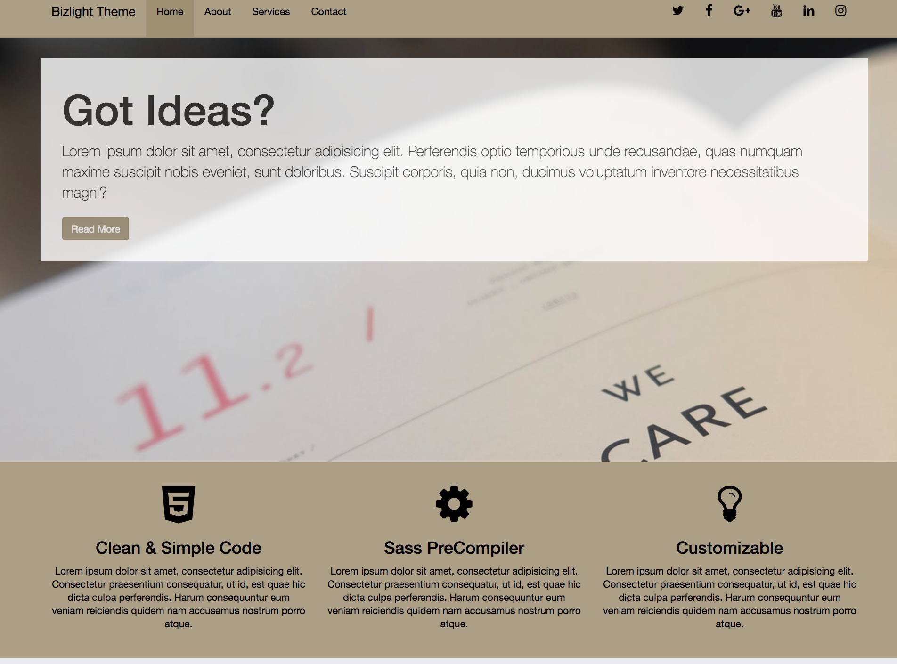

# Bizlight Bootstrap Theme

A web app that list your contacts list.

## Technologies used
* [Bower](http://materializecss.com/) - A modern responsive front-end framework based on Material Design
* [SCSS](https://developer.mozilla.org/en-US/docs/Web/CSS) - Dependency Management
* [Bootstrap](https://developer.mozilla.org/en-US/docs/Web/JavaScript)

* [Live - server] 
This is a little development server with live reload capability.

1. Installation: npm install -g live-server.
2. run: live-server
3. Port (By default): http://127.0.0.1:8080/
4. To change the port address: live-server --port=X.X.X example: 8060

## Author

* **Mohanad Elhag** - *Initial work* - [GitHub](https://github.com/moh7afiz90)

## License

This project is licensed under the MIT License - see the [LICENSE.md](LICENSE.md) file for details

